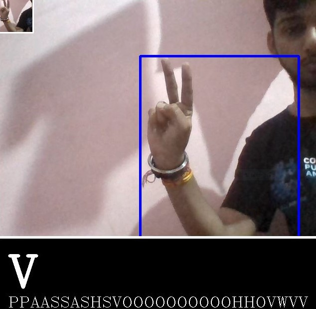
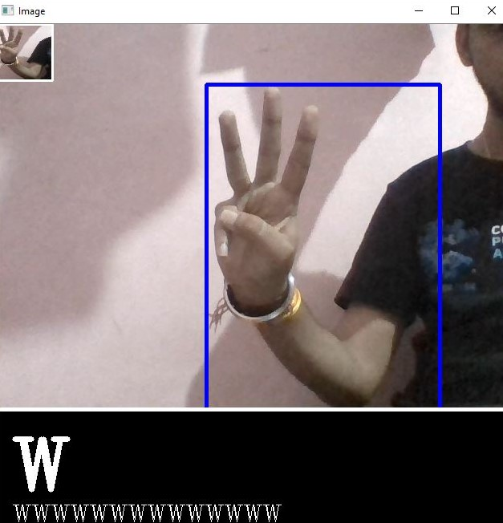
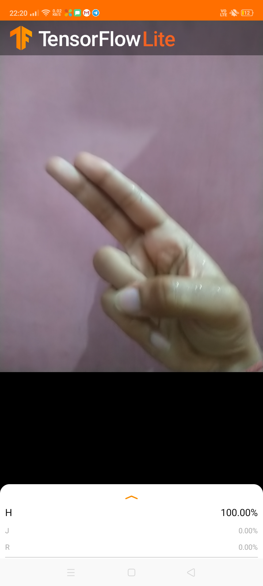
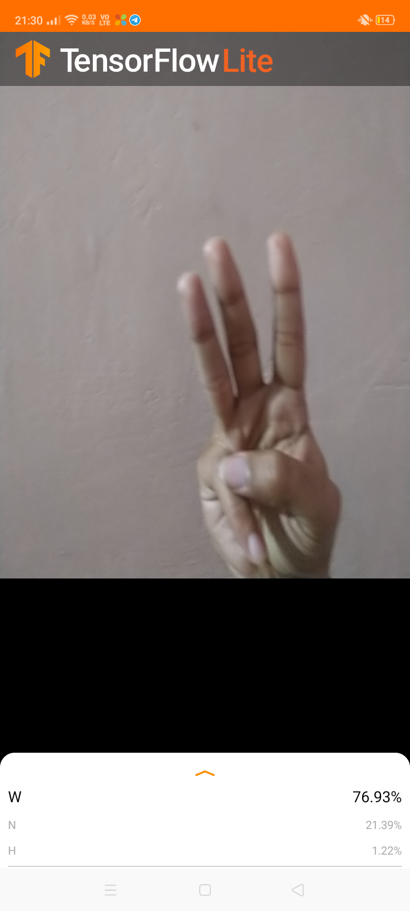
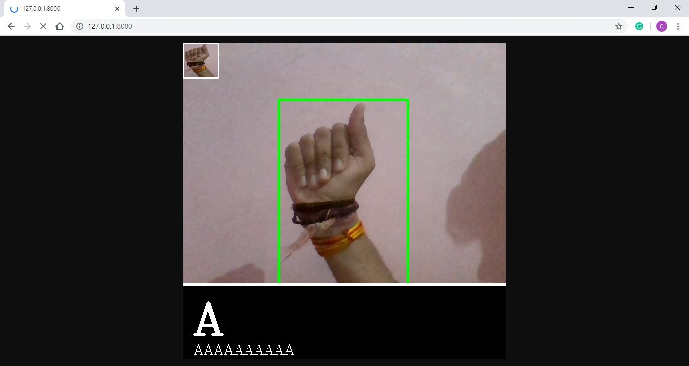
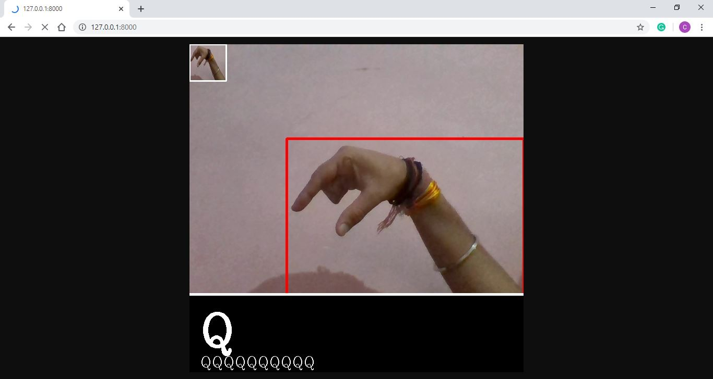
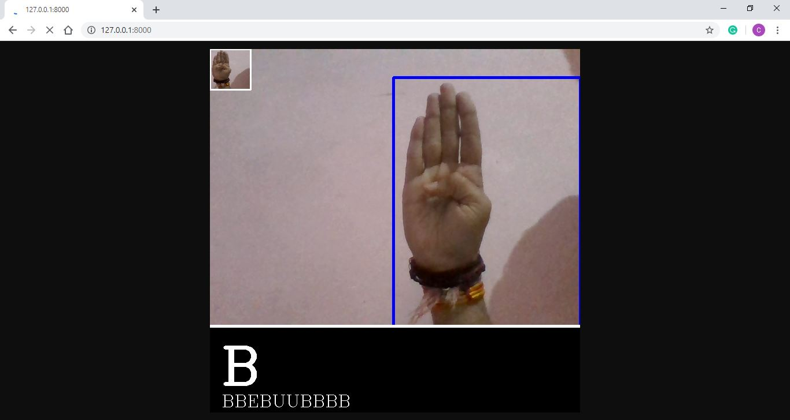

# Sign-Language-Detection
## Mobile Deployment Done
## Web Deployment Done

Real-Time Sign Language Detection Project using a WebCam.
This Project is done and I deploy it on both Mobile and Web Server.

Download link for dataset: https://www.kaggle.com/grassknoted/asl-alphabet/kernels

Here I using the pre-trained model i.e Mobilenet_v2

Due to Hardware restriction, I train Model on Kaggle playground.
Validation Accuracy = 0.9947917 and Validation Loss = 0.03621217922773212

Main File :- "Sign Language Detection (kaggle).ipynb" and "Real Done.py"

Now, the Project is on the Real-Time i.e When you capture the image from the web then the model takes that image and predicts the Alphabet.
See the code "Real-time.py" or "Real Done.py" for using the model in Real-time Basis.

NOTE:- Here's an important note that when you do real-time predictions (by using the Real-time.py or Real Done.py) than you have to keep in mind that the images which you are capturing should be neat having clean background and the intensity of the light should be moderate NO high and NO low intensity.

Real Done.py file is the file for computer vision. Below are some screenshots of that file in running using the trained model on American Sign Language Detection datasets.

## -
Now, Finally my project is deployed on mobile device

## -
Now, Finally I deploy my project on WebServer

